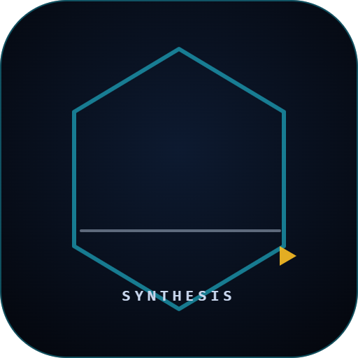
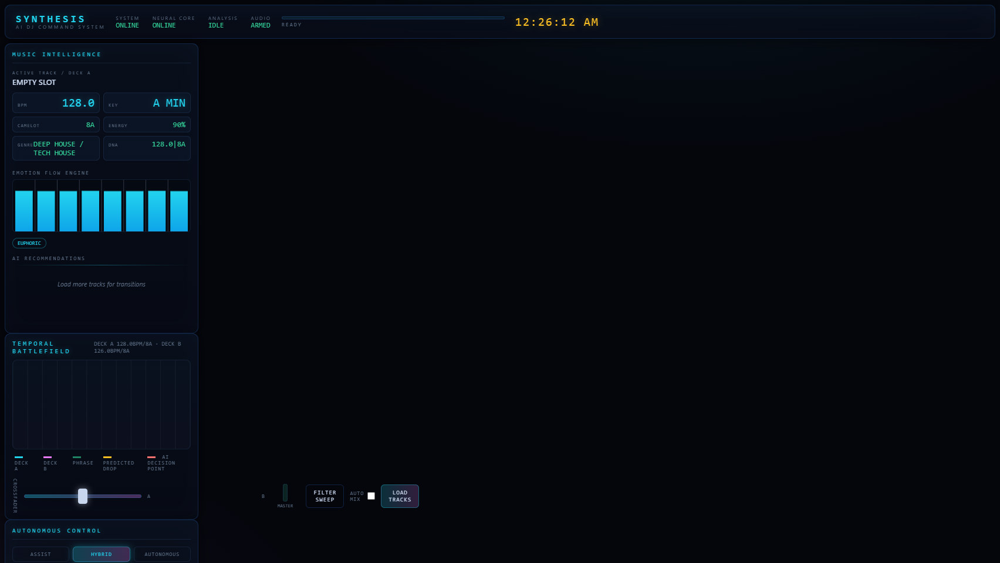
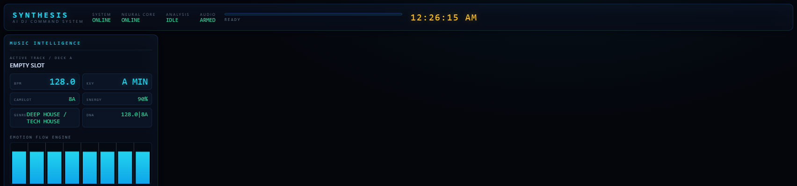

<div align="center">



# SYNTHESIS AI DJ Command System

**A military-grade autonomous music intelligence platform.**

Real-time beat, key and energy analysis. AI transition direction. Autonomous mixing.
Runs fully offline on your machine — no cloud, no tracking, no subscription.

[](LICENSE)
[](package.json)
[](docs/development.md)
[](.github/workflows/ci.yml)

</div>

---

## What is it?

SYNTHESIS is an Electron + Web Audio DJ workstation that treats every track like a
mission target: it decodes the waveform, extracts tempo, key, energy and structure,
compiles a compact **Music DNA** fingerprint for every song, and then runs an
in-browser AI director that decides _when_ and _how_ to transition between decks.

Everything runs locally. The optional **Neural Advisor** can stream tactical
narratives from any OpenAI-compatible endpoint (OpenRouter, local Ollama, etc.) —
but it is never required.

### Capabilities

- **Beat Intelligence** — onset detection, autocorrelation + comb-based BPM estimation,
  phase alignment and a full beat grid per track.
- **Harmonic Intelligence** — Krumhansl–Schmuckler key detection with Camelot wheel
  codes for instant harmonic compatibility scoring.
- **Emotion Flow Engine** — per-beat energy profiling, predicted drop points, and a
  human-readable emotional profile per track.
- **Music DNA** — every analysis compiles into a compact signature string that lets
  the AI compare tracks and predict smooth transitions.
- **AI Transition Director** — phrase mixing, drop alignment and energy breakdown
  decisions with an action list and confidence score.
- **Autonomous Modes** — ASSIST, HYBRID and full AUTONOMOUS modes with a live
  crossfader, beat-synced decks, EQ stem matrix, FX bus and jog wheels.
- **Playlist Queue** — an ordered set roster with reorder/remove controls and
  optional auto-advance, persisted across restarts.
- **Crowd Intelligence** — analyzes a whole set library and reports average BPM,
  peak-engagement track and an evolving set storyline.
- **Optional LLM Advisor** — bring-your-own-key chat-completions endpoint for
  elite-level narration and set guidance.

## Screenshots

|                      Command Center                      |                      Autonomous Mix                      |
| :------------------------------------------------------: | :------------------------------------------------------: |
|  |  |

|                    Command Bar                     |
| :------------------------------------------------: |
|  |

> Screenshots are generated from real render passes (`npm run screenshots`).
> See [docs/development.md](docs/development.md).

## Getting started

```bash
git clone https://github.com/Nortaq-PlayNexus/synthesis-dj.git
cd synthesis-dj
npm ci
npm start
```

Requires **Node.js 18+** and a desktop platform with a working Chromium sandbox
(Windows, macOS or Linux).

## Quick tour

1. Click **LOAD TRACKS** (or `Ctrl/Cmd+O`) and pick one or more audio files
   (mp3, wav, ogg, flac, m4a, aac, aiff, ...).
2. SYNTHESIS analyzes each track and reports BPM, key, Camelot code, energy, genre
   guess and Music DNA in the **MUSIC INTELLIGENCE** panel.
3. Every analyzed track lands in the **PLAYLIST QUEUE** — reorder with ▲/▼, remove
   with ✕, or hit **▶** to load and play it on a deck. The queue survives restarts.
4. The **AI RECOMMENDATIONS** list ranks the best harmonic/BPM matches for what is
   loaded on Deck A.
5. Flip **AUTO MIX** on (or select AUTONOMOUS mode) and let the Transition Director
   drive the crossfader at phrase ends, predicted drops and energy breakdowns.
6. Keep **AUTO ADVANCE** enabled and the playlist will roll forward to the next
   queued track automatically when a deck finishes its track.
7. Optional: open **NEURAL ADVISOR**, enter an OpenAI-compatible endpoint + key,
   and get tactical, confident DJ advice.

## Scripts

| Script                            | Purpose                                                     |
| --------------------------------- | ----------------------------------------------------------- |
| `npm start`                       | Launch the app.                                             |
| `npm run smoke`                   | Headless smoke test of the analysis engine inside Electron. |
| `npm test`                        | Run the Vitest unit + integration suite.                    |
| `npm run lint` / `npm run format` | Enforce ESLint + Prettier.                                  |
| `npm run screenshots`             | Regenerate the real UI screenshots.                         |
| `npm run assets`                  | Regenerate screenshots + logo render.                       |
| `npm run dist` / `dist:win`       | Build distributable installers (electron-builder).          |
| `npm run verify`                  | Lint + format check + tests + smoke, all in one.            |

## Tech stack

- **Runtime** — Electron (Chromium + Node)
- **Audio engine** — Web Audio API (`AudioContext`, `AudioBufferSourceNode`,
  BiquadFilter, Convolver, Delay, custom FX graphs)
- **Analysis** — vanilla ES-module DSP (FFT, autocorrelation, onset envelopes,
  Krumhansl key profiles)
- **AI layer** — deterministic scoring (Camelot, BPM ratio, energy flow) plus
  optional chat-completions narration
- **Tooling** — Vitest, ESLint (flat config), Prettier, electron-builder
- **Security** — `contextIsolation: true`, `nodeIntegration: false`, sandboxed
  preload bridge, strict CSP in `index.html`

## Documentation

- [Getting started](docs/getting-started.md)
- [Architecture](docs/architecture.md)
- [Analysis engine](docs/analysis-engine.md)
- [AI engine](docs/ai-engine.md)
- [API reference](docs/api.md)
- [Development guide](docs/development.md)
- [Deployment & packaging](docs/deployment.md)
- [Diagrams](docs/diagrams.md)

## Repository

- [Contributing](CONTRIBUTING.md)
- [Code of Conduct](CODE_OF_CONDUCT.md)
- [Security policy](SECURITY.md)
- [Roadmap](ROADMAP.md)
- [Changelog](CHANGELOG.md)

## License

[MIT](LICENSE) © Nortaq-PlayNexus
