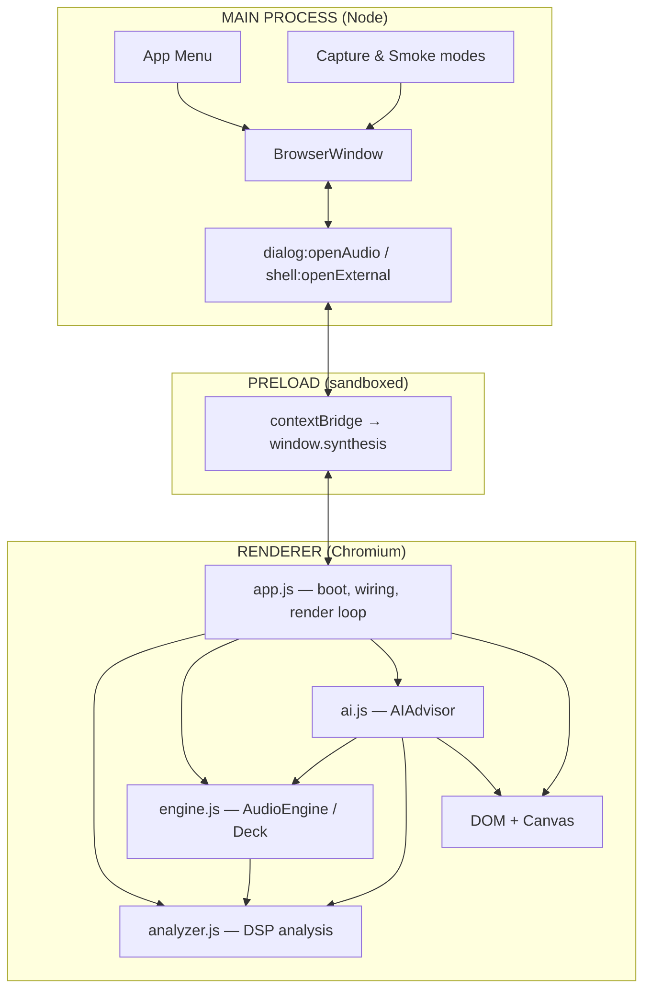
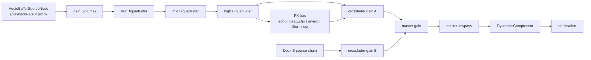
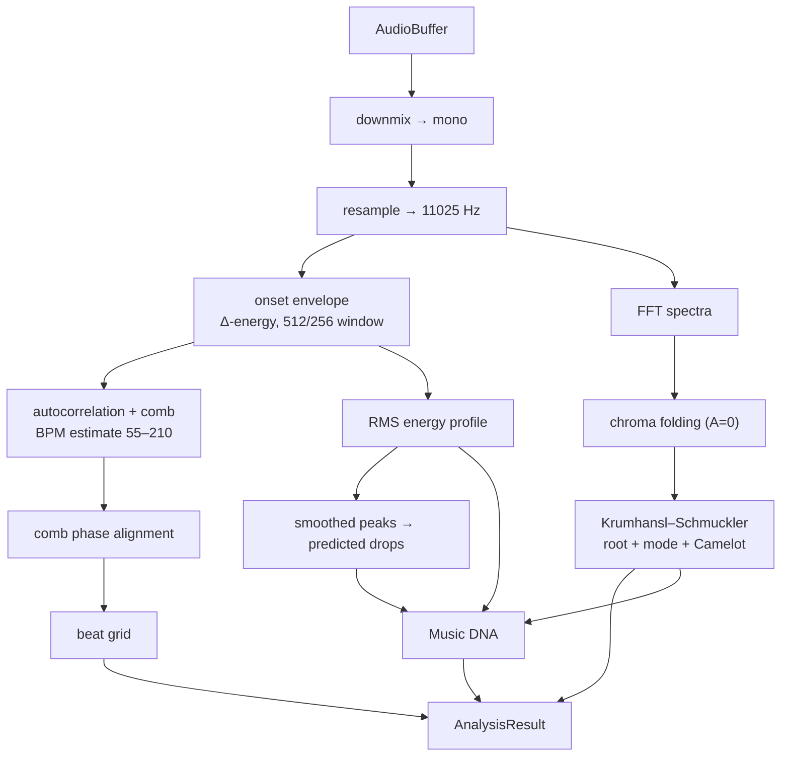
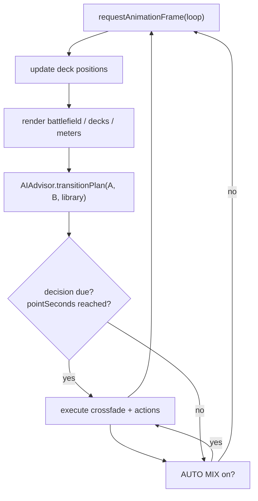
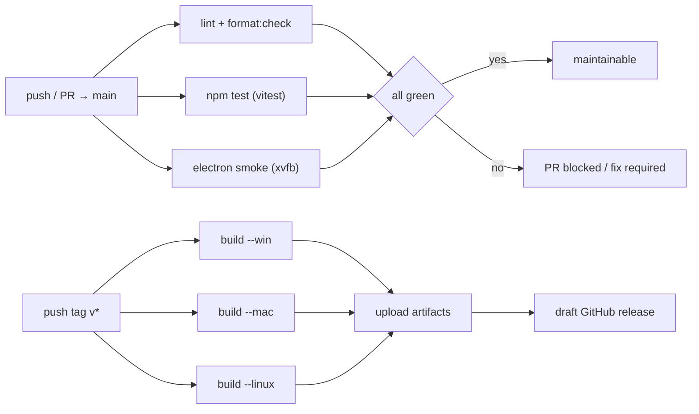

# Diagrams

Visual overviews of SYNTHESIS. Mermaid blocks render on GitHub; ASCII versions are
included for offline reading.

## 1. System overview



ASCII:

```
  Main process ──menu:load──▶ window.synthesis ──▶ app.js
       ▲                                 │ decodeAudioData
       │ file bytes                      ▼
  dialog:openAudio  ◀──────────────── analyzer.js ──▶ analysis + DNA
                                            │
      shell:openExternal ◀── external link │
                                            ▼
                                       engine.js (decks)
                                            ▲
       UI controls ◀── app.js ◀── ai.js (director) ──▶ crossfader/stems
```

## 2. Audio graph per deck



Each deck owns its chain (volume → EQ → FX → crossfade gain). Only the crossfader
mixes A and B; the master strip is shared.

## 3. Analysis pipeline



## 4. AI director loop (per animation frame)



The director anchors on phrase boundaries (16 bars), predicted drops and energy
breakdowns, and only executes when the scheduled point is reached and AUTO MIX is
armed.

## 5. CI / release flow



See [deployment.md](deployment.md) for the exact workflow definitions.
